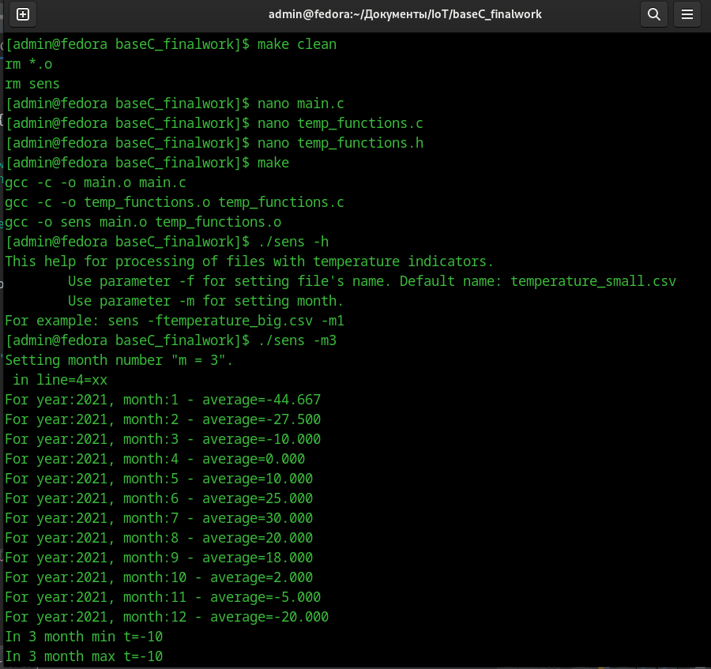

# Создание консольного приложения —
## Статистика температуры
Необходимо реализовать консольное приложение, которое осуществляет
считывание текстового файла csv, состоящего из строк следующего формата:
YEAR;MONTH;DAY;HOUR;MINUTE;TEMPERATURE
dddd;mm;dd;hh;mm;temperature
dddd - год 4 цифры
mm - месяц 2 цифры
dd - день 2 цифры
hh - часы 2 цифры
mm - минуты 2 цифры
temperature - целое число от -99 до 99  
## Требования к обработке данных
Необходимо вывести статистику по каждому месяцу, с учетом исходных данных:  
● среднемесячная температура  
● минимальная температура в текущем месяце  
● максимальная температура в текущем месяце  
### Также необходимо вывести статистику за год:  
● среднегодовая температура  
● минимальная температура  
● максимальная температура
## Требования к аргументам командной строки
Приложение должно обрабатывать аргументы командной строки:
минимальный набор поддерживаемых ключей:  
● -h Описание функционала приложения. Список ключей, которые
обрабатывает данное приложение и их назначение  
● -f <filename.csv> входной файл csv для обработки  
● -m <номер месяца> если задан данный ключ, то выводится только статистика
за указанный месяц  
● если нет параметров, то выдается help  
## Требования к сборке приложения
● Приложение должно собираться при помощи утилиты make.  
● Все прототипы функций, используемые в приложении, должны быть
вынесены в отдельный файл temp_functions.h  
● Тексты функций — в файл temp_functions.c  
● Для реализации приложения рекомендуется использовать массив из
структурного типа данных для хранения показаний датчика.  

